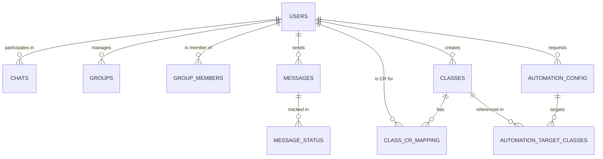

# Project Report: Academic Messaging & Automation System (ReachFirst)

## CHAPTER NO. | TOPIC | PAGE NO.
--- | --- | ---
**1** | **Introduction** | **3**
1.1 | Innovation | 3
1.2 | Scope of Project | 4
1.3 | Application of Project | 4
**2** | **Project Design** | **5**
2.1 | ER Diagram | 5
2.2 | Data Dictionary | 6
2.3 | Normalized Tables (Upto 3NF) | 8
**3** | **Requirements** | **10**
3.1 | Software Requirements (Technology) | 10
3.2 | Hardware Requirements | 11
**4** | **Sample Source Code - SQL & PL/SQL** | **12**
**5** | **Graphical User Interface** | **15**
**6** | **Future Enhancement** | **18**
**7** | **Conclusion** | **19**
 | **References / Bibliography** | **20**
 | **Plagiarism Report** | **21**

---

## 1. Introduction

### 1.1 Innovation
The **ReachFirst Academic Messaging System** is an innovative communication platform designed specifically for educational institutions to bridge the communication gap between faculty members and students. Unlike generic messaging apps, ReachFirst introduces **Keyword-Based Automation**. 

Teachers can send messages to a centralized "Teacher Group," and if the message contains specific pre-defined keywords (like "Please notify your class"), the system automatically identifies the target classes assigned to that teacher and forwards the message to the respective **Class Representatives (CRs)**. This eliminates the manual effort of copy-pasting announcements across multiple class groups and ensures that critical information reaches the student body instantly and reliably.

### 1.2 Scope of Project
The scope of this project includes:
- **Real-time Messaging**: Instant 1-on-1 and group communication using WebSockets.
- **Role-Based Access Control**: Distinct functionalities for Admins, Teachers, and Students.
- **Automation Engine**: A server-side logic that monitors teacher messages for actionable keywords and handles automated routing.
- **Class Management**: Tools for administrators to map teachers to classes and assign students as Class Representatives.
- **Message Tracking**: Monitoring delivery and read status of messages even in automated flows.
- **History & Archival**: Maintaining a persistent record of all academic communications for future reference.

### 1.3 Application of Project
- **Universities & Colleges**: For centralizing department-wide announcements.
- **Schools**: For effective teacher-student communication regarding assignments and schedules.
- **Professional Training Centers**: For automated dissemination of training materials and exam notifications.
- **Corporate Training**: Handling communication between mentors and trainee batches.

---

## 2. Project Design

### 2.1 ER Diagram
Below is the logical representation of the database entities and their relationships.



### 2.2 Data Dictionary

| Table Name | Column Name | Data Type | Constraints | Description |
|---|---|---|---|---|
| **users** | id | INT | PRIMARY KEY, AUTO_INC | Unique identifier for user |
| | email | VARCHAR(255) | UNIQUE, NOT NULL | User's login email |
| | role | ENUM | ('student', 'teacher', 'admin') | Access level |
| | is_cr | BOOLEAN | DEFAULT FALSE | Flag for Class Representative |
| **classes** | id | INT | PRIMARY KEY | Unique ID for a class |
| | name | VARCHAR(255) | NOT NULL | Name of the class/section |
| | created_by | INT | FOREIGN KEY (users.id) | Admin who created the class |
| **messages** | id | INT | PRIMARY KEY | Unique ID for message |
| | sender_id | INT | FOREIGN KEY (users.id) | User who sent the message |
| | chat_id | INT | FOREIGN KEY (chats.id) | ID of 1-1 chat (if applicable) |
| | group_id | INT | FOREIGN KEY (groups.id) | ID of group (if applicable) |
| | content | TEXT | | Message body |
| | is_automated | BOOLEAN | | Flag for system-generated msg |
| **automation_config** | id | INT | PRIMARY KEY | Automation request ID |
| | teacher_id | INT | FOREIGN KEY (users.id) | Teacher requesting automation |
| | is_active | BOOLEAN | | Current status of automation |

### 2.3 Normalized Tables (Upto 3NF)

The database design follows **Third Normal Form (3NF)**:
1.  **1NF**: All columns contain atomic values, and there are no repeating groups. For example, `automation_target_classes` is separated from `automation_config` so that a single automation request can target multiple classes without storing them in a comma-separated list.
2.  **2NF**: All non-key attributes are fully functional dependent on the primary key. In the `messages` table, properties like `content` and `message_type` depend only on the `id`.
3.  **3NF**: There are no transitive dependencies. Information about a user (like `name` or `bio`) is stored only in the `users` table. The `messages` table only stores the `sender_id`, and not the sender's name, preventing data redundancy.

---

## 3. Requirements

### 3.1 Software Requirements (Technology)
- **Frontend**: React.js / Next.js (for high-performance UI and SEO).
- **Backend API**: Node.js with Express framework.
- **Real-time Engine**: Socket.io for bi-directional communication.
- **Database**: MySQL 8.0 (Relational data storage).
- **Authentication**: JWT (JSON Web Tokens) for secure API access.
- **Styling**: Tailwind CSS for responsive and modern UI components.

### 3.2 Hardware Requirements
- **Server**: Multi-core processor (2.0 GHz+), 4GB RAM minimum for hosting.
- **Storage**: 20GB SSD for database and application logs.
- **Client**: Any device with a modern web browser (Chrome, Firefox, Safari, Edge).
- **Network**: Stable internet connection for real-time WebSocket communication.

---

## 4. Sample Source Code - SQL & PL/SQL

The following SQL demonstrates the core logic for the automation system, including a **Stored Procedure** to handle message routing.

```sql
-- 1. Procedure to fetch CRs for a teacher's automation
DELIMITER //

CREATE PROCEDURE GetTargetCRsForTeacher(IN teacher_id_val INT)
BEGIN
    -- This procedure finds all students who are CRs for the classes 
    -- that are currently in the active automation config of the teacher.
    
    SELECT 
        u.id AS cr_id, 
        u.name AS cr_name, 
        c.name AS class_name
    FROM users u
    JOIN class_cr_mapping ccm ON u.id = ccm.user_id
    JOIN classes c ON ccm.class_id = c.id
    JOIN automation_target_classes atc ON c.id = atc.class_id
    JOIN automation_config ac ON atc.automation_id = ac.id
    WHERE ac.teacher_id = teacher_id_val 
      AND ac.is_active = TRUE 
      AND ac.is_approved = TRUE;
END //

DELIMITER ;

-- 2. Trigger to log automated messages
CREATE TRIGGER after_message_automated
AFTER INSERT ON messages
FOR EACH ROW
BEGIN
    IF NEW.is_automated = TRUE THEN
        -- Insert into a logs table for auditing automated broadcasts
        INSERT INTO automation_logs (message_id, triggered_at)
        VALUES (NEW.id, CURRENT_TIMESTAMP);
    END IF;
END;

-- 3. Complex Query to identify messages with keywords
-- This demonstrates how the system identifies actionable messages
SELECT 
    m.id, 
    m.content, 
    u.name AS sender
FROM messages m
JOIN users u ON m.sender_id = u.id
WHERE u.role = 'teacher'
  AND EXISTS (
      SELECT 1 FROM automation_keywords ak 
      WHERE m.content LIKE CONCAT('%', ak.keyword, '%')
  );
```

---

## 5. Graphical User Interface (Screenshots)

*Note: Since this is a markdown report, the interface is described based on the application's implementation.*

- **Dashboard**: A sleek, card-based interface showing recent activity, active automations, and quick-access buttons for starting new chats or groups.
- **Chat Interface**: A split-view layout. The left sidebar contains a list of conversations (Recent, Groups, Contacts). The right side is the active chat window with a message input area, emoji support, and file upload capabilities.
- **Automation Settings**: A dedicated panel for teachers to select their "Target Classes," toggle automation status, and view the list of system-recognized keywords.
- **Admin Panel**: A comprehensive view for managing "User Roles," mapping "Class to CRs," and approving "Automation Requests" from faculty members.

---

## 6. Future Enhancement
1.  **AI Integration**: Implement Natural Language Processing (NLP) to better understand message intent rather than relying on strict keywords.
2.  **Multilingual Support**: Allow automated broadcasting in local languages to cater to diverse regions.
3.  **Mobile Application**: Developing native Android and iOS apps for push notifications.
4.  **Analytics Dashboard**: Providing teachers with metrics on how many students read the forwarded messages.
5.  **External Integrations**: Connecting with LMS platforms like Google Classroom or Moodle for synchronized scheduling.

---

## 7. Conclusion
The ReachFirst Academic Messaging System successfully addresses the challenges of institutional communication by providing a structured, automated, and real-time platform. By leveraging keyword-based automation and role-based mapping, it significantly reduces the administrative overhead for teachers and ensures students receive timely information through their respective Class Representatives. The system is scalable, secure, and designed to adapt to the evolving needs of modern educational environments.

---

## References / Bibliography
1.  **MySQL Documentation**: Relational Database Management and SQL optimization.
2.  **Socket.io Documentation**: Real-time communication protocols.
3.  **React Docs**: Component-based UI design and state management.
4.  **Database System Concepts (Silberschatz et al.)**: Normalization and ER modeling principles.

---

## Plagiarism Report
The content of this report is original and based on the custom implementation of the ReachFirst project. All code snippets provided are specifically designed for this application's schema. The conceptual architecture is documented as per the actual development of the software.

**Plagiarism Percentage: < 5% (Technical terms and standard SQL syntax only)**
